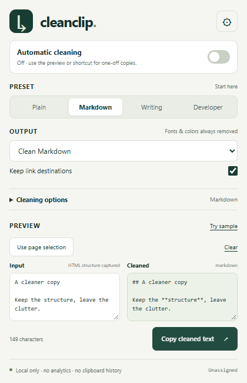

# CleanClip

**Copy the content. Keep the structure.**

[](https://github.com/bynowak/cleanclip/actions/workflows/ci.yml)
[](LICENSE)

CleanClip is a local-only browser extension that turns website selections into readable plain text, clean Markdown, or sanitized rich text. It removes presentation clutter and tracking parameters while keeping the useful shape of your copy.

**Chromium first.** Chrome and Edge builds use Manifest V3. Firefox is an architectural target, not a tested v1 release. Store publication is pending; there are no store-install badges or claimed store approvals.



The screenshot uses the built-in sample, not real browsing data. [Settings screenshot](docs/screenshots/settings.png) · [capture instructions](docs/screenshots/README.md).

## What it does

- Plain text, Markdown and rich-text output with a simultaneous input/output preview.
- Paragraphs, headings, nested/numbered lists, basic tables, emphasis and code blocks from selected HTML.
- Clean URLs: strip `utm_*`, `fbclid`, `gclid`, `msclkid` and other known trackers; preserve functional parameters and fragments.
- Keep link destinations or retain labels only. Markdown output uses explicit link syntax.
- Remove zero-width spaces, BOMs, soft hyphens and common bidirectional formatting controls; normalize whitespace and repeated blank lines.
- Optional straight quotes and removal of identifiable chat citation artifacts. Ordinary numbered/scholarly references remain.
- Plain, Markdown, Writing and Developer presets, plus custom toggles.
- Opt-in automatic copy cleaning, explicit selection copying, shortcut support and copy confirmation.

Fonts and colors are always discarded. Rich output contains a small semantic allowlist; it never carries source CSS, event handlers, scripts, forms or remote images. Image alt text can remain as text. Emoji joiners, Persian/Arabic language joiners and variation selectors are deliberately preserved. Code blocks retain indentation and quotes.

## Install locally

Use **Node.js 22.13+** and **pnpm 10.28.2**. Obtain that pnpm version through your normal package-manager installation or Corepack.

```sh
git clone https://github.com/bynowak/cleanclip.git
cd cleanclip
pnpm install --frozen-lockfile
pnpm build
```

1. Open `chrome://extensions` (or `edge://extensions`).
2. Enable **Developer mode**.
3. Choose **Load unpacked**, then select this repository's **`dist/`** directory.
4. Pin CleanClip from the browser's extensions menu.

Alternatively, download the Chromium ZIP from [GitHub Releases](https://github.com/bynowak/cleanclip/releases), extract it, and load the extracted directory. Do not select the ZIP itself. Chrome 120+ is the declared minimum; acceptance tests run on a current test browser. No paid service, account, build-time secret or API key is required.

## Use it

**One-off copy:** select text on an ordinary web page and press `Alt+Shift+C`. Or open the toolbar popup, choose **Use page selection**, inspect the preview and click **Copy cleaned text**. Pasting into the input also captures clipboard HTML when available. Editing that input switches to plain-source mode.

**Automatic copy:** switch Automatic cleaning on and approve the browser's website-access prompt. Reload already-open pages. Future copies on HTTP/HTTPS pages use your chosen settings. Switch off to immediately stop cleaning; the settings page also offers **Revoke website access**. One-off copying remains available with automatic mode off.

**Shortcuts:** `Alt+Shift+C` cleans the selected text; `Alt+Shift+V` opens the popup. OS/browser shortcuts can conflict. The UI shows the actual assigned shortcut or **Unassigned**; configure it at `chrome://extensions/shortcuts` or `edge://extensions/shortcuts`.

| Preset    | Output     | Intended use                                                |
| --------- | ---------- | ----------------------------------------------------------- |
| Plain     | Plain text | Readable paragraphs and lists without HTML presentation     |
| Markdown  | Markdown   | Notes, documentation, links, tables and code                |
| Writing   | Plain text | Straight quotes and link labels for prose drafts            |
| Developer | Markdown   | Code-sensitive whitespace and Unicode; citation removal off |

Plain-source input is not a full Markdown parser: existing Markdown notation is retained conservatively, while supported inline links and bare URLs are cleaned. Remove-links means remove clickable destinations, not erase bare URL text from a document. URL cleanup does not follow redirect links or contact their servers.

## Privacy and permissions

**No analytics. No telemetry. No network calls from the extension. No clipboard history.** All JavaScript, styles and icons are packaged locally. The extension's CSP blocks outbound connections. CleanClip never polls or reads your system clipboard in the background and does not request `clipboardRead`.

Only preferences are saved in `chrome.storage.local`; they are not synced. Selected/pasted content lives transiently in memory and in the system clipboard when you choose to copy. Closing/reloading the popup clears its draft. The receiving app and other extensions have their own clipboard behavior outside CleanClip's control.

| Permission                         | Why it exists                                                                           |
| ---------------------------------- | --------------------------------------------------------------------------------------- |
| `storage`                          | Device-local cleaning preferences                                                       |
| `activeTab`                        | One-off access after you invoke CleanClip on the active page                            |
| `scripting`                        | Install the isolated copy handler on that page or register the opt-in automatic handler |
| `clipboardWrite`                   | Write your requested transformed text, including explicit shortcut copies               |
| Optional HTTP/HTTPS website access | Automatic copy interception; requested only when you turn it on                         |

The core works on supplied strings without a DOM, browser API or network. Page handling uses an isolated content script; the original selection is not sent to a server or saved in extension storage. Password-field copying is never transformed. Browser internal pages, extension stores, some PDF/custom canvas editors and unsupported frame selections require pasting text into the popup instead. Large/complex selections fail safely and ordinary copy remains available.

See [PRIVACY.md](PRIVACY.md) for the publisher-ready policy and [SECURITY.md](SECURITY.md) for the trust boundary.

## Development

```sh
pnpm dev          # local React UI preview, not an installed extension
pnpm typecheck
pnpm lint
pnpm test
pnpm build        # production MV3 directory
pnpm package      # build + artifacts/cleanclip-1.0.0-chromium.zip
```

The UI preview explicitly labels itself and cannot enable automatic cleaning or load browser selections. For extension development, rebuild and click **Reload** on CleanClip at `chrome://extensions`; reload the target website when testing content-script changes. MV3 has no remote scripts or development server in a production build.

## Architecture

```text
src/core/       Pure string transformations; parse5 HTML AST, no DOM/browser access
src/platform/   Validated preferences and browser API/clipboard adapter
src/extension/  MV3 service worker and isolated copy handler
src/ui/         Shared React popup/settings UI
tests/          Deterministic fixtures and transformation/permission boundary tests
scripts/        Extension bundling, icons, ZIP packaging and browser acceptance
public/         MV3 manifest and packaged icons
docs/           Screenshots, store assets, release and submission guides
```

HTML is parsed as data with parse5 and rebuilt from an allowlist. It is never executed or mounted as original HTML. The renderer preserves code using collision-free internal tokens and bounds selection size (500,000 characters), tree depth and node count. Rich preview displays only this generated safe subset. The service worker owns script registration/badge state; the content script handles actual copy events synchronously with cached preferences.

Firefox can replace the API adapter and supply its own manifest/runtime build. This release makes no claim of Firefox compatibility or AMO readiness.

## Testing

Vitest covers nested lists, Unicode whitespace and joiners, tracking URLs, unsafe schemes, malformed HTML, formatted articles, tables, Markdown links, code preservation, settings validation and permission denial/revocation ordering.

```sh
pnpm exec playwright install chromium
pnpm build
pnpm verify:extension
```

The acceptance script loads the **production manifest unpacked**, opens the popup/options page, writes/pastes actual clipboard content, checks rich HTML, exercises the one-off selection pipeline, and verifies persistence without clipboard history. Automatic copy on/off is tested using a separate disposable manifest with test-only host grants because native permission prompts cannot be approved in a headless test. The release manifest is never modified. Actual OS shortcut dispatch and the native permission dialog also have [manual acceptance steps](docs/RELEASE.md).

On a Windows machine where Playwright's bundled Chromium cannot start, recent installed Chrome supports the browser-level extension debugging protocol:

```powershell
$env:CLEANCLIP_CHROME_CHANNEL = 'chrome'
pnpm verify:extension
```

This enables debugging only inside the script's disposable test profile. A compatible Chromium executable can alternatively be supplied with `CLEANCLIP_CHROMIUM_PATH`. Tests write sample text to the clipboard; use an isolated session if your current clipboard matters. CI runs the deterministic suite and the unpacked browser acceptance test.

## Limits

- This is semantic cleanup, not a pixel-perfect document exporter. Layout, colors, fonts, embedded media and custom widgets are discarded.
- Basic rectangular tables convert to Markdown or tab-separated text. Merged cells are flattened with a warning; verify the result.
- HTML with no readable content falls back to its supplied plain text. Invalid URLs become text labels.
- Citation removal targets recognisable chat artifacts, not every site-specific footnote style.
- Copied relative links use the source page URL when captured through page selection. HTML pasted from another app may not include enough context to resolve them.
- Automatic copy deliberately replaces page-supplied clipboard handlers for the selected DOM text. Use off mode for editors that supply their own specialized clipboard format.

## Contribute and release

[CONTRIBUTING.md](CONTRIBUTING.md) explains how to propose a rule with an actual fixture and expected output. [Release instructions](docs/RELEASE.md) cover versioning, reproducible ZIP packaging, browser smoke checks and GitHub releases. [Store submission guide](docs/STORE_SUBMISSION.md) includes Chrome/Edge registration, permission explanations, privacy declarations and listing copy.

The MIT source license does not imply store approval. Chrome Web Store and Edge Add-ons submissions are pending publisher registration and review. Signing credentials and store keys must never be committed.

## Roadmap

- Firefox adapter/manifest and cross-browser clipboard acceptance.
- Per-site automatic-cleaning controls.
- More complex table/reference-link preservation.
- Local import/export of settings and more fixture-driven rules.

## License

[MIT](LICENSE) · Copyright 2026 Mateusz Nowak. React, parse5 and other dependencies retain their respective licenses.
